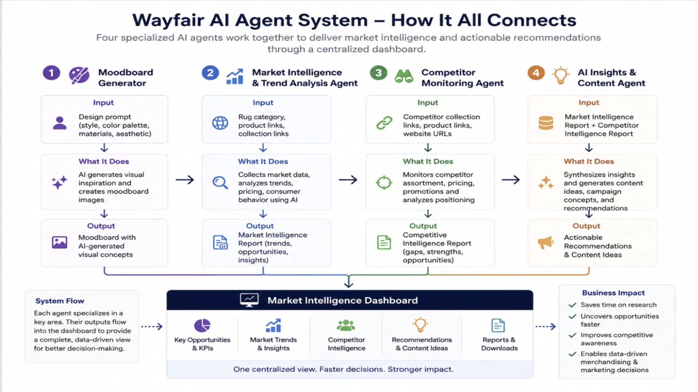
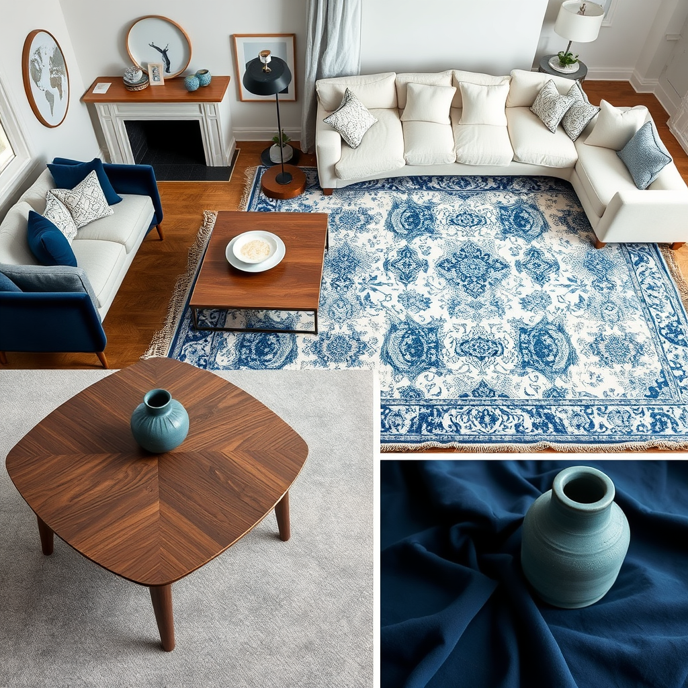
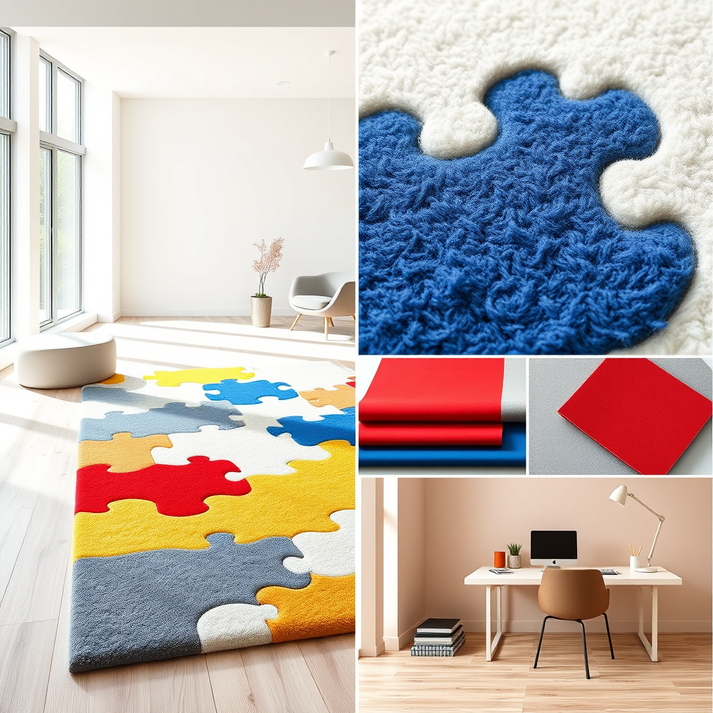
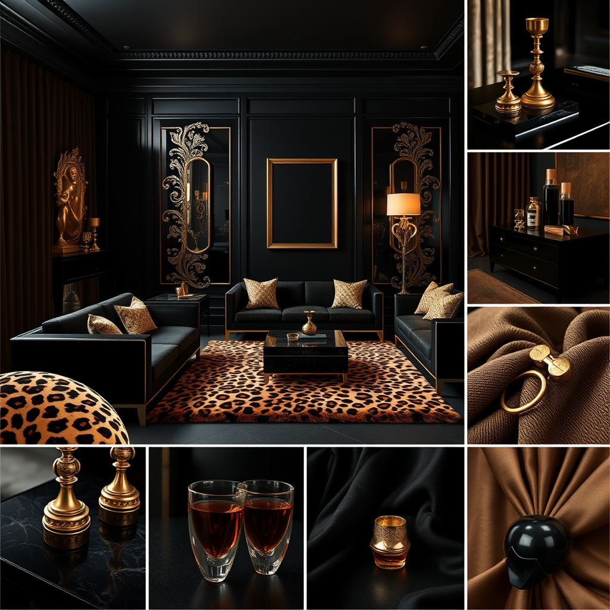
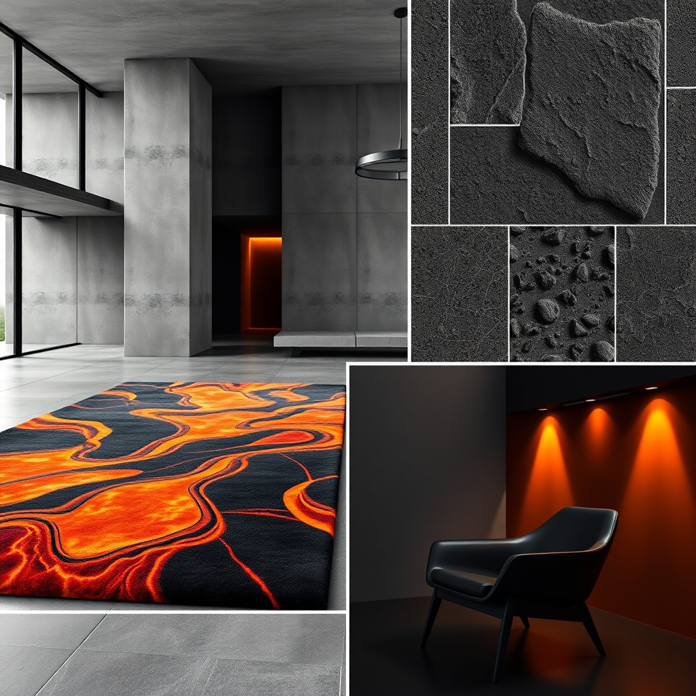
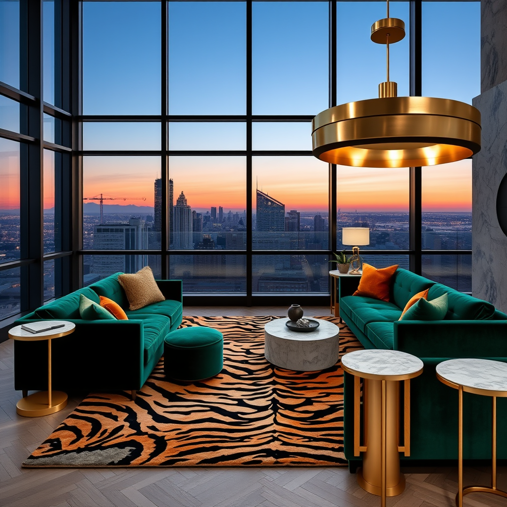

# Wayfair AI Agent Engineering for Business Intelligence | Extern

Four AI-automated agents (n8n + Gemini/Mistral) delivering competitive intelligence across Amazon, Walmart, and Wayfair, unified in an interactive dashboard covering 58 products. Built during the Wayfair AI Agent Engineering for Business Intelligence Externship (Top 10% performer).

**Live dashboard:** https://pvindyala.github.io/wayfair-ai-agents-bi-externship/

> **Note:** This work was created as part of an externship in collaboration with Wayfair. Wayfair has not necessarily reviewed or endorsed these workflows.

---

## Tools & technology

- **Platform**: n8n
- **AI models**: Google Gemini, Mistral
- **Data collection**: ScraperAPI
- **Sources**: Amazon, Walmart, and Wayfair

## Overview

This project simulates a real-world business intelligence workflow for Wayfair's rug category: scraping competitor pricing and product data, using AI to extract trends and generate insights, and packaging everything into a decision-ready dashboard. The system runs on four specialized n8n-orchestrated agents, each handling a distinct stage of the pipeline.

## Architecture

Data flows from three retail sources via ScraperAPI into four n8n-orchestrated agents (powered by Gemini and Mistral), which produce the final interactive dashboard.

## The four agents

| # | Agent | What it does | Output |
|---|---|---|---|
| 1 | **Moodboard Generator** | Generates AI-driven visual concepts and styled moodboards from design prompts | [Samples](outputs/01-moodboard-generator-outputs.pdf) · [Workflow](docs/agent-1-moodboard-generator-screenshot.png) |
| 2 | **Market Intelligence** | Collects market data, analyzes pricing and trends across retailers | [Report](outputs/02-market-intelligence-report.pdf) · [Workflow](docs/agent-2-market-intelligence-screenshot.pdf) |
| 3 | **Competitor Monitoring** | Tracks competitor assortment, pricing, and positioning | [Report](outputs/03-competitor-monitoring-report.pdf) · [Workflow](docs/agent3-competitor-monitoring-workflow.pdf) |
| 4 | **AI Insights & Recommendations** | Synthesizes findings into actionable recommendations and content ideas | [Report](outputs/04-ai-insights-recommendations-report.pdf) · [Workflow](docs/agent-4-ai-insights-recommendations-screenshot.png) |

The dashboard itself is assembled by its own n8n workflow — see [`docs/dashboard-n8n-workflow.png`](docs/dashboard-n8n-workflow.png).

## Key findings

- **Significant pricing gap**: Wayfair rugs average **$260**, compared to **$80** on Amazon and **$65** on Walmart for comparable products
- **$400+ premium whitespace opportunity** identified in the upper price tier, underserved by current competitor offerings
- Micro-segment style trends surfaced across category (e.g. celestial, maximalist, industrial-modern), informing merchandising and content strategy

## Moodboard Generator — sample outputs

The Moodboard Generator agent produces AI-generated visual concepts from natural-language design prompts. A sample of five outputs across different aesthetics:

<table>
<tr>
<td width="50%">

**Celestial bedroom**

*Prompt: Crescent moon rug, celestial-inspired bedroom, midnight blue palette, brushed brass decor, glowing ambient light, dreamy styled interior.*

</td>
<td width="50%">

**Playful office**

*Prompt: Puzzle-piece rug, playful, creative office, primary-color accents, modular furniture, bright natural lighting, styled interior.*

</td>
</tr>
<tr>
<td width="50%">

**Hollywood Regency lounge**

*Prompt: Leopard print rug, Hollywood Regency lounge, black lacquer furniture, gold detailing, dramatic moody lighting, styled interior.*

</td>
<td width="50%">

**Ultra-modern living room**

*Prompt: Lava-inspired rug, ultra-modern living room, charcoal palette, textured concrete walls, dramatic accent lighting, styled interior.*

</td>
</tr>
<tr>
<td width="50%">

**Maximalist penthouse**

*Prompt: Tiger-stripe rug, maximalist penthouse, emerald velvet furniture, brass lighting, bold editorial styling, styled interior.*

</td>
<td width="50%"></td>
</tr>
</table>

Full set of outputs: [`outputs/01-moodboard-generator-outputs.pdf`](outputs/01-moodboard-generator-outputs.pdf)

## Repository structure
    wayfair-ai-agents-bi-externship/
    ├── outputs/          # Final PDF deliverables from all 4 agents
    ├── docs/             # Live dashboard, architecture diagram, n8n workflow documentation
    ├── LICENSE
    └── README.md
  
## Recognition

Recognized as a **Top 10% performer** in the Wayfair AI Agent Engineering for Business Intelligence Externship (via Extern). [See LinkedIn post →](https://www.linkedin.com/feed/update/urn:li:activity:7484676412424163328/)

## Author

Pratik Vindyala
